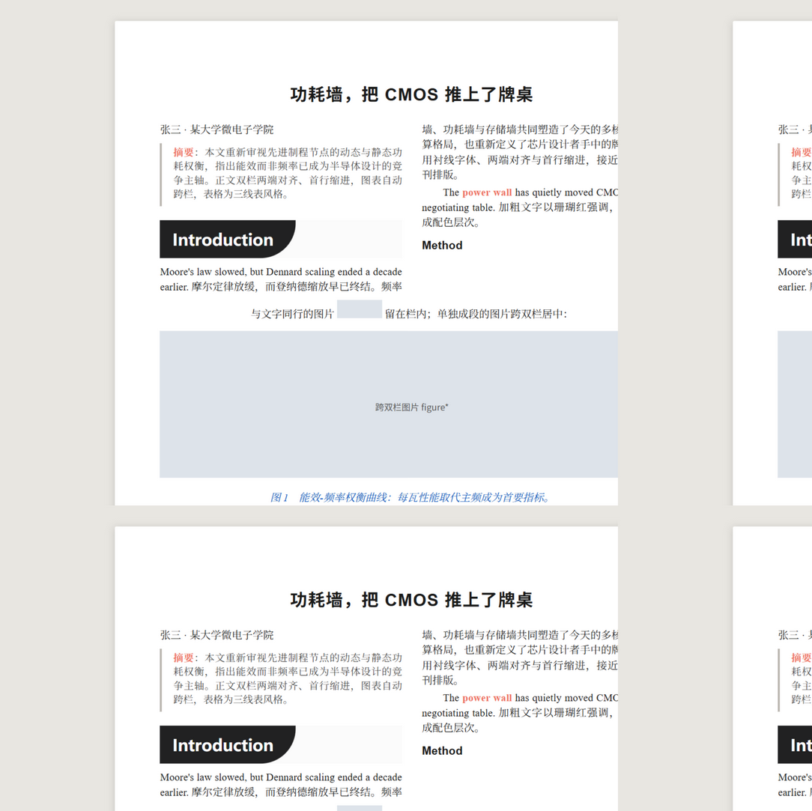
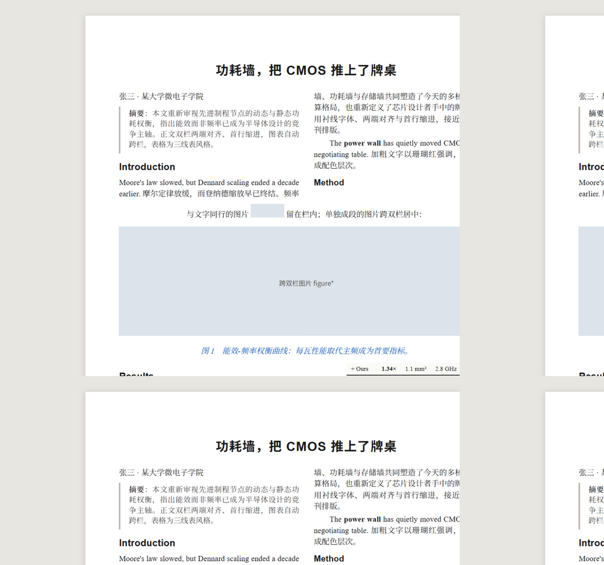
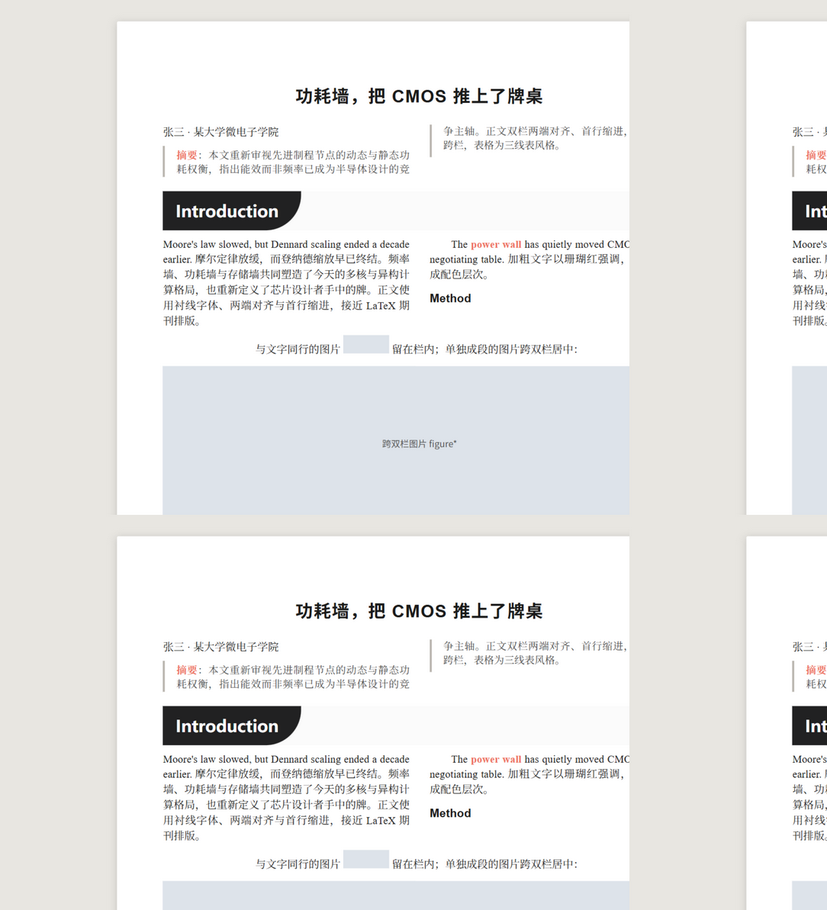
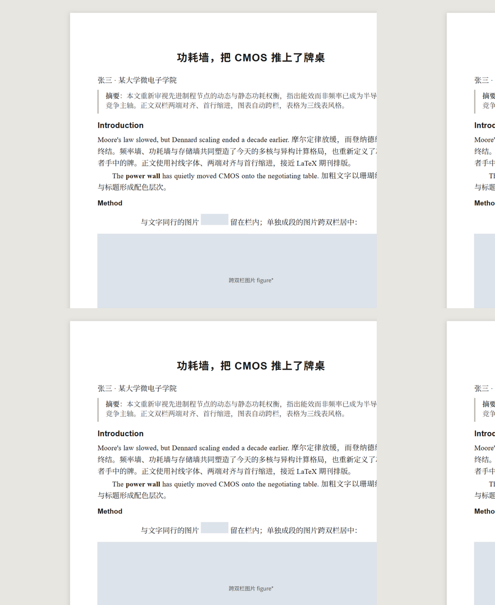
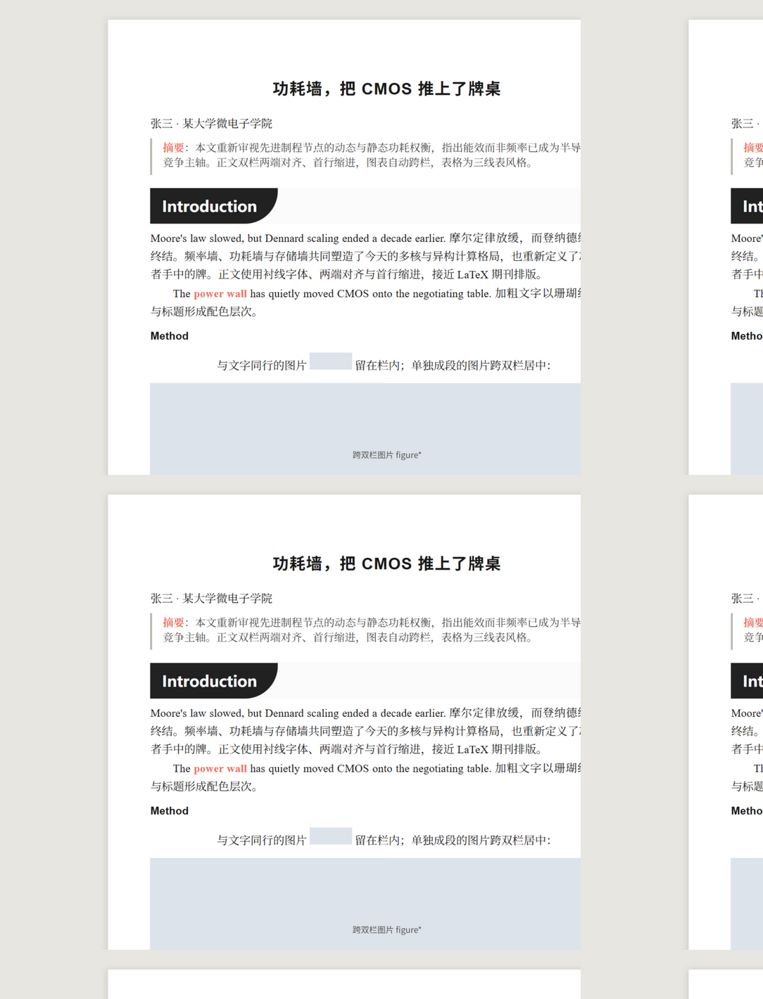

# Typlatex — a LaTeX-style theme family for Typora

**Typlatex = Typora + LaTeX.** It typesets your Markdown like a journal
article: an A4 paper preview, justified two-column text, serif body type,
first-line indents, booktabs tables, figures that span columns, and blue
captions — and exports to a true A4 two-column PDF.



[中文文档（详细）](README.zh-CN.md) | [Gallery post](https://theme.typora.io/)

## Style gallery — all six variants

The same document, rendered under each theme:

| Theme | Column rhythm | Look | Preview |
|-------|---------------|------|---------|
| `typlatex` | Two-column, journal | Plain |  |
| `typlatex-book` | Two-column, book (H2 spans page) | Plain |  |
| `typlatex-ink` | Two-column, journal | Ink |  |
| `typlatex-book-ink` | Two-column, book | Ink |  |
| `typlatex-article` | Single column (12pt / 1.6) | Plain |  |
| `typlatex-article-ink` | Single column | Ink |  |

## The theme family (6 variants)

Two dimensions — column rhythm × look:

| Theme (menu name) | Column rhythm | Look |
|-------------------|---------------|------|
| `typlatex` | Two-column, journal style (continuous flow) | Plain |
| `typlatex-book` | Two-column, book style (each H2 spans the page) | Plain |
| `typlatex-ink` | Two-column, journal style | Ink |
| `typlatex-book-ink` | Two-column, book style | Ink |
| `typlatex-article` | Single column, traditional (12pt / 1.6 line-height) | Plain |
| `typlatex-article-ink` | Single column, traditional | Ink |

**Plain** keeps headings quiet and typographic. **Ink** gives H2 a dark
label with one huge bottom-right round corner set into a light-gray track,
and colors bold text coral (`#EF7060`).

All six share identical typesetting rules — only rhythm and decoration
differ. Switch themes any time from Typora's `Themes` menu; the same
document works everywhere.

## Feature guide

### A4 paper & two columns

- The document renders on a white A4 card over a gray desk.
- Body text: 10.5pt serif, justified, 2-character first-line indent
  (the paragraph right after a heading is not indented, as in LaTeX).
- `@page { size: A4; margin: 16mm 16mm 18mm }` — export PDF with margins
  set to *Default* and you get exactly the page you see.
- Narrow windows (< 980px) fall back to one column for comfortable editing;
  export is unaffected.

### Figures & captions

| How you write it | What you get |
|------------------|--------------|
| Image alone in a paragraph | Spans both columns, centered (like `figure*`) |
| Image inline with text | Stays in-column with the text |
| `<p class="nospan"></p>` | Forced in-column, centered |
| Italic-only paragraph right after a figure *(blank line or not)* | Blue, centered caption that follows the figure's span behavior |

Caption color is configurable: `--caption-color` at the top of the CSS.

### Span anything with `---`

A horizontal rule acts as an **invisible trigger**: the next block —
paragraph, `$$` math block, or table — spans both columns.

```markdown
---

$$
\begin{aligned}
f(x) &= a+b+c+d+e+g+h \\
     &= \text{…}
\end{aligned}
$$
```

Notes:

- The rule itself is hidden (edit it in source mode, `Ctrl+/`). To bring
  the visible rule back, delete the `#write > hr, #write .md-hr > hr
  { display: none }` rule.
- **Always leave a blank line *above* `---`** — otherwise the line above
  becomes a setext H2 (a Markdown rule, not a theme one).
- A `<span class="full"></span>` at the start of a paragraph is an
  alternative invisible trigger for that paragraph.
- Spanning is per-block: each block needs its own trigger.

### Tables

Booktabs-style three-line tables, in-column by default (8.5pt). Put `---`
above a table to make it span both columns (9pt).

### Math

- Inline `$…$` needs *Preferences → Markdown → Inline Math* enabled.
- Display `$$…$$` blocks are centered, never clipped; break long formulas
  with `aligned` + `\\` + `&`.
- To make a specific display block span columns, put `---` above it.

### Headings

- H1 is the article title: spans the page, centered.
- Headings are **not** auto-numbered — write numbers in the heading text
  (`## 1. Introduction`). An optional auto-numbering block is included,
  commented out, at the end of each CSS file.

## Installation

1. Download & unzip (or clone) this repository.
2. Typora → `File → Preferences → Appearance → Open Theme Folder`.
3. Copy the `.css` file(s) you want into that folder.
4. Restart Typora and pick the theme from the `Themes` menu.

**Requirements:** Typora ≥ 1.6 (uses CSS `:has()`); tested on Typora
1.14.9 / Windows. For `demo.md`, enable inline math in preferences to see
`$…$` render.

## Customization

Everything lives in the `:root` block at the top of each CSS file:

| Variable | Default | Meaning |
|----------|---------|---------|
| `--page-width` | `178mm` | A4 content width (210 − 2×16mm margins) |
| `--page-margin` | `16mm` | Screen & `@page` margins |
| `--col-gap` | `7mm` | Column gap |
| `--font-size` | `10.5pt` | Body size (12pt in article themes) |
| `--line-height` | `1.45` | Body line height (1.6 in article themes) |
| `--para-indent` | `2em` | First-line indent (`0` disables) |
| `--caption-color` | `#0b53c2` | Figure caption color |

Ink themes: heading geometry is marked with a `装修/replica` comment —
colors `#212122` / `#FBFBFB`, corner radius `35pt`, paddings.

## Known limitations

- Blank lines cannot act as triggers: `---\nX` and `---\n\nX` produce
  identical DOM, so no CSS can distinguish them.
- A paragraph containing *text + inline image + line break + italic-only
  tail* may be mistaken for a figure with caption (keep figures or
  captions in their own paragraphs to avoid).
- Spanning blocks (figures, `---` triggers) rebalance the columns above
  them — place big spans at natural paragraph boundaries for the best look.

## License

[MIT](LICENSE)
